# 用 Docker-Nginx-Jenkins-GitLab 搭建 CI/CD 环境

- Docker 提供容器环境
- docker-compose 定义和运行由多个容器组成的应用
- Jenkins 持续集成交付
- GitLab 代码仓库
- Harbor 私有镜像仓库
- Verdaccio 私有 npm 仓库

## 在 Ubuntu 上安装 Docker Engine

### 准备工作

- 系统要求

  - Ubuntu Kinetic 22.10
  - Ubuntu Jammy 22.04 (LTS)
  - Ubuntu Focal 20.04 (LTS)
  - Ubuntu Bionic 18.04 (LTS)

- 卸载旧版本

  ```sh
  sudo apt-get remove docker docker-engine docker.io containerd runc
  ```

### 安装方法

- 使用 APT 安装

  - apt 升级，并添加相关软件包

    ```sh
    sudo apt-get update
    ```

    ```sh
    sudo apt-get install \
        apt-transport-https \
        ca-certificates \
        curl \
        gnupg \
        lsb-release
    ```

  - 为了确认所下载软件包的合法性，需要添加软件源的 `GPG` 密钥（鉴于国内网络问题，改用国内源）

    ```sh
    # 权限不够时先执行这个，够则不执行
    sudo mkdir -m 0755 -p /etc/apt/keyrings
    ```

    ```sh
    curl -fsSL https://mirrors.ustc.edu.cn/docker-ce/linux/ubuntu/gpg | sudo gpg --dearmor -o /etc/apt/keyrings/docker.gpg
    ```

  - 向 `sources.list` 中添加 Docker 软件源

    ```sh
    echo \
      "deb [arch=$(dpkg --print-architecture) signed-by=/etc/apt/keyrings/docker.gpg] https://mirrors.ustc.edu.cn/docker-ce/linux/ubuntu \
      $(lsb_release -cs) stable" | sudo tee /etc/apt/sources.list.d/docker.list > /dev/null
    ```

  - 更新 apt 软件包缓存，并安装 `docker-ce`

    ```sh
    sudo apt-get update
    ```

    默认的 umask 可能配置错误，导致无法检测到存储库公钥文件。在更新包索引之前，尝试授予 Docker 公钥文件的读权限：

    ```sh
    sudo chmod a+r /etc/apt/keyrings/docker.gpg
    sudo apt-get update
    ```

    安装 `docker-ce`

    ```sh
    sudo apt-get install docker-ce docker-ce-cli containerd.io docker-buildx-plugin docker-compose-plugin
    ```

- 使用脚本安装（未实操）

  > `--mirror` 选项，指定源进行安装
  >
  > `--dry-run` 选项，了解脚本在被调用时将运行哪些步骤

  ```sh
  curl -fsSL get.docker.com -o get-docker.sh
  sudo sh get-docker.sh --dry-run --mirror Aliyun
  ```

### 启动 Docker

```sh
sudo systemctl enable docker
sudo systemctl start docker
```

### 建立 Docker 用户组

```sh
# 建立 docker 组
sudo groupadd docker

# 将当前用户加入 docker 组
sudo usermod -aG docker $USER
```

退出当前终端并重新登录，进行如下测试。

### 测试 Docker 安装是否正确

```sh
docker run --rm hello-world
```

### 配置镜像加速

由于镜像服务可能出现宕机，所以建议配置多个镜像。`/etc/docker/daemon.json` （如果没有就新建）中写入如下内容：

```sh
{
  "registry-mirrors": [
    "https://dockerhub.azk8s.cn",
    "https://reg-mirror.qiniu.com",
    "https://hub-mirror.c.163.com",
    "https://mirror.baidubce.com"
  ]
}
```

> 注意，一定要保证该文件符合 json 规范，否则 Docker 将不能启动。

之后重新启动服务：

```sh
sudo systemctl daemon-reload
sudo systemctl restart docker
```

## 安装 Nginx，Jenkins，GitLab 镜像

```sh
docker pull nginx
docker pull jenkins/jenkins:lts
docker pull gitlab/gitlab-ce
```

为了配合 compose，以及方便管理以上三个镜像的文件，统一把他们建立在 `$HOME` 的文件夹下，`$HOME` 就是与你用户名同名的那个文件夹 `/home/user`，`user` 为你的用户名。（这里暂且先在 `$HOME` 下，后面会再尝试放在公共目录下，到时再更新）

```sh
mkdir -p docker/{jenkins/jenkins_home,nginx,gitlab,compose,webserver}
```

以上命令，通过 `mkdir` ， 建立目录如下：

```
home
  user
  + docker
    + jenkins
      + jenkins_home
    + nginx
    + gitlab     // gitlab 文件存放
    + compose    // 管理docker-compose.yml 后续会提到
    + webserver  // 用于项目发布的地方
```

`compose` 文件夹下新建 `docker-compose.yml` ，内容如下：

```yml
version: '1'
services: # 集合
  docker_jenkins:
    user: root # 为了避免一些权限问题 在这使用了root
    restart: always # 重启方式
    image: jenkins/jenkins:lts # 指定服务所使用的镜像 在这里我选择了 LTS (长期支持)
    container_name: jenkins # 容器名称
    ports: # 对外暴露的端口定义    外部端口:内部端口
      - 8081:8080
      - 50000:50000
    volumes: # 卷挂载路径   系统本地目录:容器内目录
      - $HOME/docker/jenkins/jenkins_home/:/var/jenkins_home # 这是我们一开始创建的目录挂载到容器内的jenkins_home目录
      - /var/run/docker.sock:/var/run/docker.sock
      - /usr/bin/docker:/usr/bin/docker # 这是为了我们可以在容器内使用docker命令
      - /usr/local/bin/docker-compose:/usr/local/bin/docker-compose
  docker_nginx:
    restart: always
    image: nginx
    container_name: nginx
    ports: # 有几组端口号（433不算），就可以部署几组静态页面，也就是编译好的前端项目，这样就可以实现部署多个项目
      - 80:80
      - 81:81
      - 82:82
      - 433:433
    volumes:
      - $HOME/docker/nginx/conf:/etc/nginx
      - $HOME/docker/nginx/logs:/var/log/nginx
      - $HOME/docker/webserver:/usr/share/nginx/html
  docker_gitlab:
    restart: always
    image: gitlab/gitlab-ce
    container_name: gitlab
    ports:
      - 10443:443
      - 1080:80
      - 1022:22
    volumes:
      - $HOME/docker/gitlab/config:/etc/gitlab
      - $HOME/docker/gitlab/logs:/var/log/gitlab
      - $HOME/docker/gitlab/data:/var/opt/gitlab
```

## 配置 Nginx

Nginx 这里有一个坑，如果是全新的环境，没有 Nginx 相关配置的话，直接使用 `docker compose up -d` 启动容器（即用上面的配置挂载卷启动 Nginx），Nginx 会一直重启，导致我们无法正常访问部署的页面。那么怎么解决呢？

要给 Nginx 挂载卷，要先有一个配置文件才能挂载，具体做法就是先以不挂载卷的形式正常启动一个 Nginx 容器，然后从中 `cp` 拷贝一份配置文件，删除这个容器，再重新以挂载卷的形式启动一个新容器。

```sh
# 以不挂载卷的形式正常启动一个 Nginx 容器
docker run -d -p 80:80 --name nginx-test nginx

# 从容器拷贝配置文件到本地目录
docker cp nginx-test:/etc/nginx $HOME/docker/nginx/conf

# 停止 nginx-test 容器
docker stop nginx-test

# 删除 nginx-test 容器
docker rm nginx-test
```

到 `$HOME/docker/nginx/conf` 目录下 `ls`，会发现如下目录与文件：

```sh
conf.d  fastcgi_params  mime.types  modules  nginx.conf  scgi_params  uwsgi_params
```

`nginx.conf` 中存放着 Nginx 总体的配置，它引用了 `mime.types` 和 `conf.d/*.conf` ，而 `conf.d` 中只有一个默认的 server 配置文件 `default.conf` 。我们可以在 `nginx.conf` 中直接修改或添加配置，也可以在 `conf.d` 目录下创建新的 server 配置，如 `vue3-vite-ts.conf` ，`web2.conf` ：

```
# vue3-vite-ts.conf

server {
  listen       81;
  listen  [::]:81;
  server_name  localhost;
  location / {
     root   /usr/share/nginx/html/vue3-vite-ts;
     index  index.html index.htm;
  }
}
```

```
# web2.conf

server {
  listen       82;
  listen  [::]:82;
  server_name  localhost;
  location / {
    root   /usr/share/nginx/html/web2;
    index  index.html index.htm;
  }
}
```

此处 listen 监听的端口只是内部端口，即 `docker-compose.yml` 文件中 `ports` 下 `- 81:81` 中，冒号后边的那个，冒号前边的才是给浏览器访问用的。

至此，Nginx 就配置好了，下面启动服务：

```sh
# 后台启动所有容器（-d 是后台启动）
docker compose up -d

# 停止所有容器
# docker compose stop

# 停止所有容器
# docker compose restart
```

然后就可以用 `ip:80` 访问到 Nginx 自带的欢迎页， `ip:81` 、 `ip:82` 访问我们自己的项目，在 `$HOME/docker/webserver` 目录下创建 `web2/index.html` ，随便写点东西就可以去浏览器用 `ip:82` 查看了（ip 用你自己的主机 ip 替换），至于 `vue3-vite-ts` ，我们留着后边用工作流发过来。

## 配置 Jenkins

- 解锁 Jenkins

  服务启动之后，就可以用 **主机 ip + 上边配置的端口** 来访问 Jenkins 的页面了，如 `http://192.168.119.118:8081/`，会出现如下的页面：

  

  去 `$HOME/docker/jenkins/jenkins_home/secrets/initialAdminPassword` 中找密码，粘过来即可。

  过程中可能 `secrets` 文件夹没有权限打开，执行 `sudo su` 切换到 root 用户，即可打开。

- 安装插件

  安装推荐安装的插件。

- 创建第一个管理员用户

  填写用户信息，然后点击 **保存并完成**。

- 配置 Jenkins URL

  保持默认即可，直接点击 **保存并完成**。

- Jenkins 已就绪

  **开始使用Jenkins**，然后就进入你前边创建的管理员用户登录的页面了。

- 管理插件

  点击 **Manage Jenkins** ---> **Manage Plugins**

  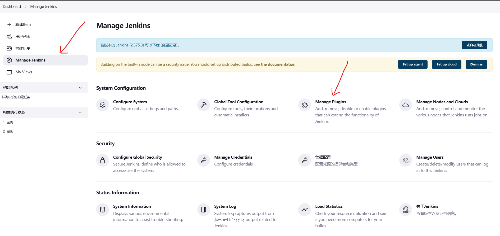

  点击 **Avaliable plugins**，搜索勾选 **NodeJS** 、**Publish Over SSH** 、**GitLab** 插件，点击 **Install without restart** 直接安装

  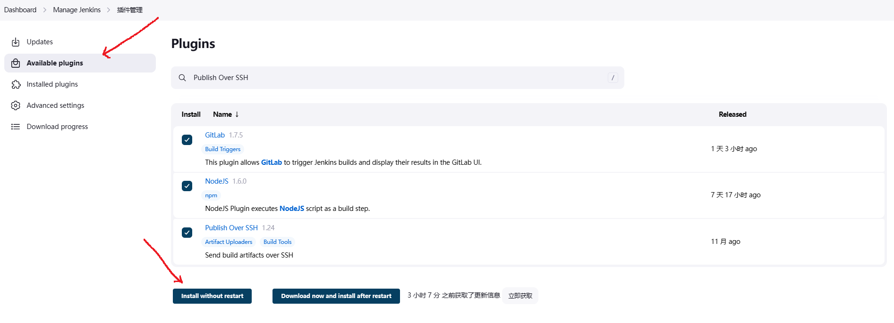

  安装完成后，回到 **Manage Jenkins** ，**Manage Jenkins** ---> **Global Tool Configuration** ，配置 nodejs

  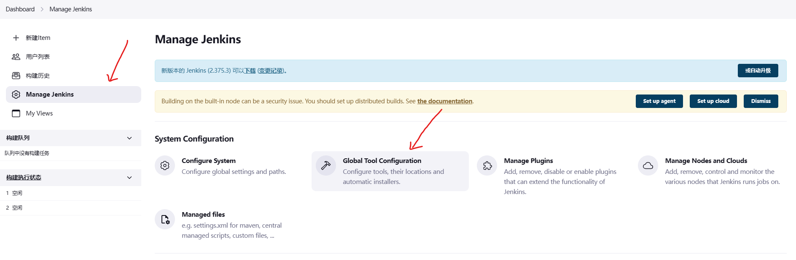

  找到 **NodeJS** ，**新增 NodeJS** ，选择最新的 LTS 版本，保存

  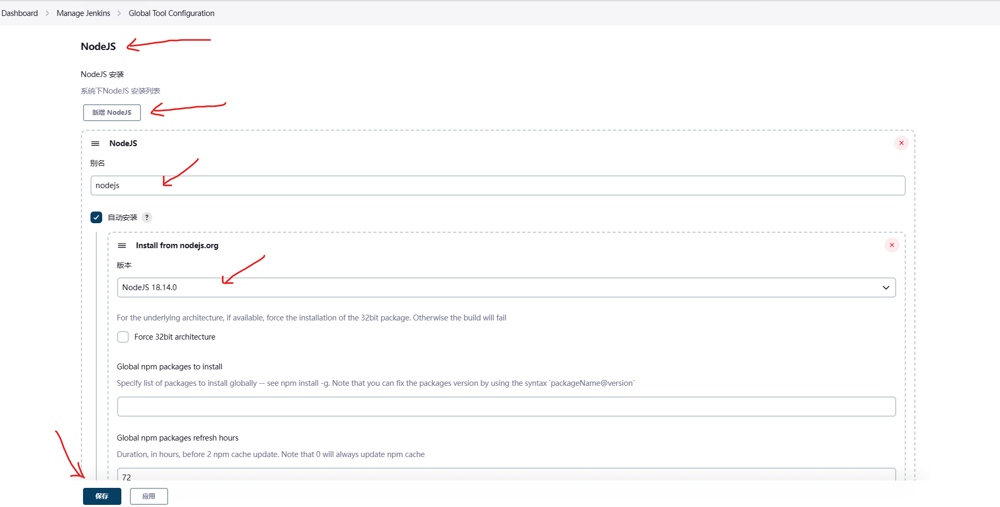

  回到 **Manage Jenkins** ，**Manage Jenkins** ---> **Configure System** ，在最下边找到 Publish Over SSH 并配置

  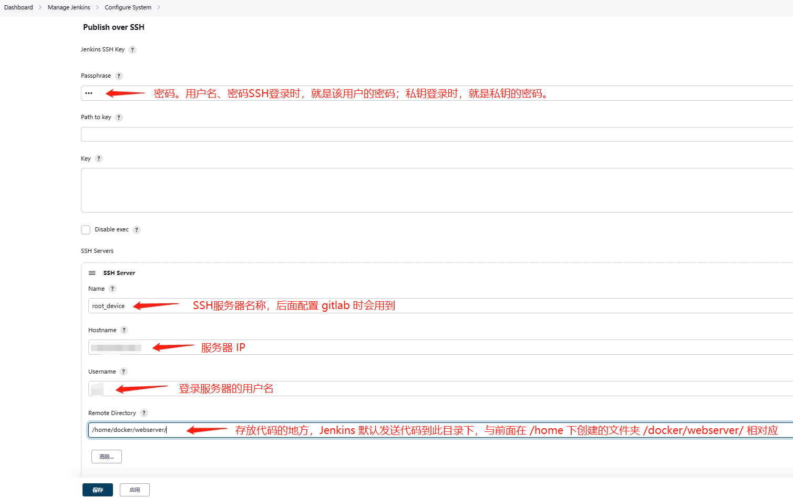

## 配置 GitLab

- 进入 GitLab

  服务启动之后，就可以用 **主机 ip + 端口号** 来访问 GitLab 的页面了，如 `http://192.168.119.118:1080/`。

- 使用 root 密码登录

  进入页面后，如果没有重置密码的界面，而直接是登录界面，那就需要去 `$HOME/docker/gitlab/config/initial_root_password` 找到密码，用户名是 root ，然后登录即可。

## Jenkins 和 GitLab 关联

### GitLab 中创建个人访问令牌

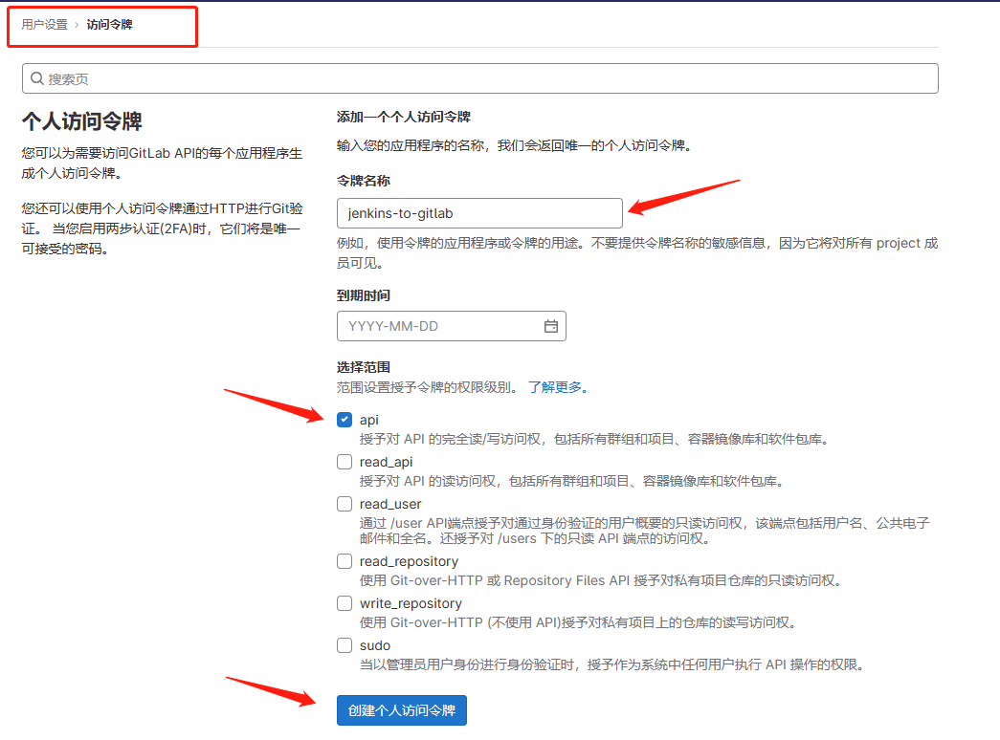

创建好之后会出现这个

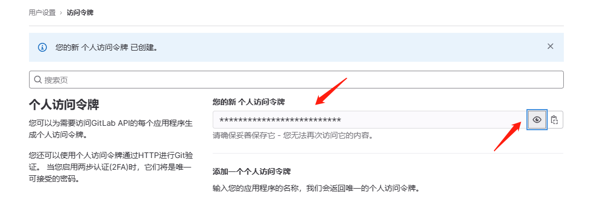

点击右侧小眼睛可以查看，**将内容复制出来保存好，后边会用**。

### Jenkins 中配置任务

在 Jenkins 中 **新建任务**，然后进行以下配置。

- 配置 *源码管理*，填写对应的源码库与分支

  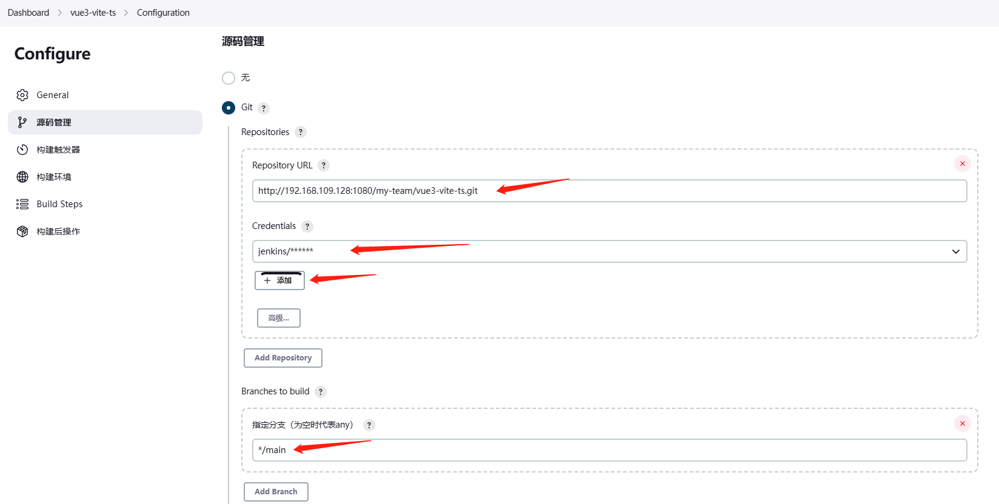

  Credentials 一项点击 **添加**，类型选择 Username with password ，用户名填之前在 GitLab 中创建的 jenkins 用户，密码填对应的密码（这里笔者也用过 SSH Username with private key，但一直没有成功）。

  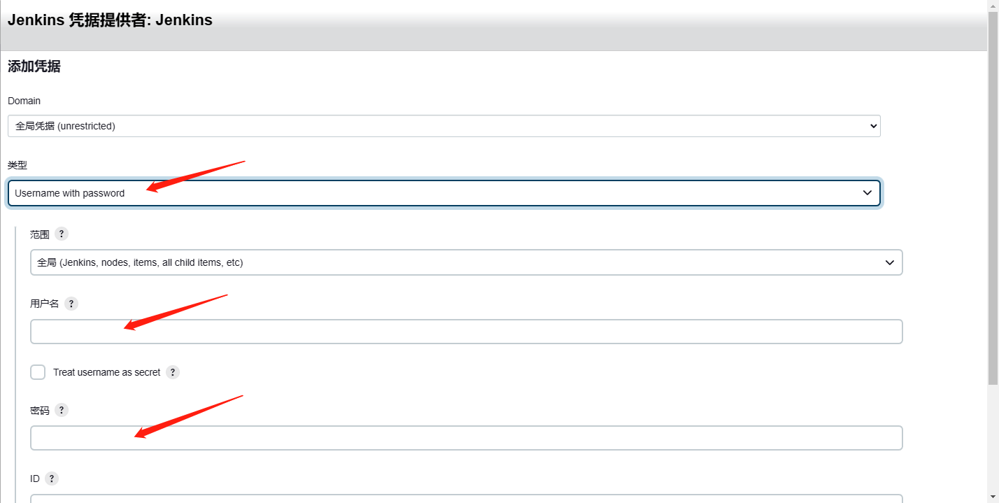

- 配置 *构建触发器*

  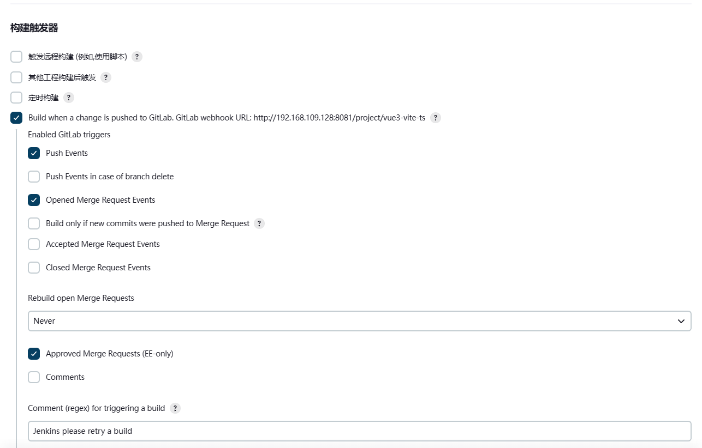

- 配置 *构建环境*

  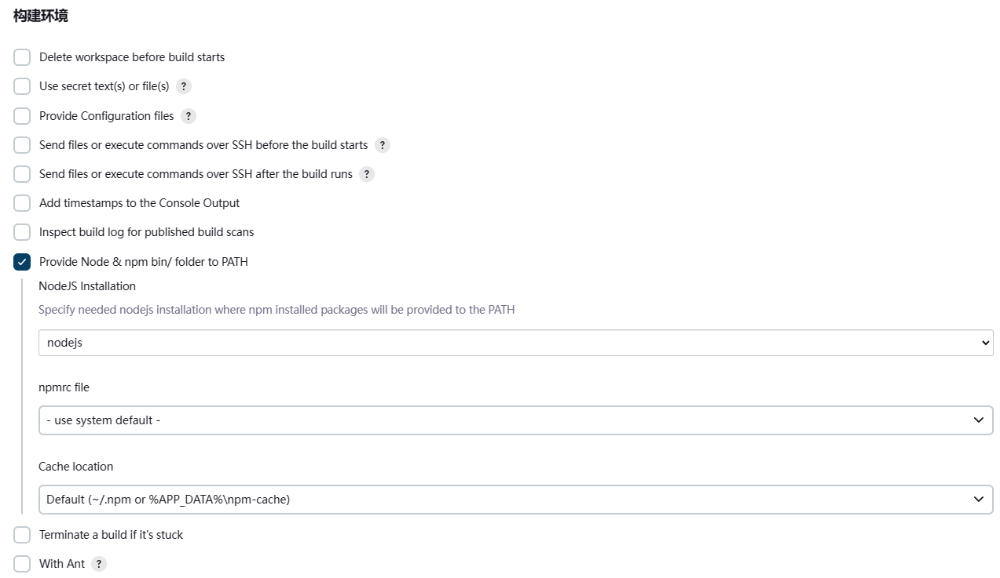

- 配置 *Build Steps*

  **增加构建步骤** ---> **执行 shell** ，输入需要执行的命令：

  ```sh
  node -v
  npm -v
  npm install -g pnpm --registry=https://registry.npmmirror.com
  pnpm -v
  pnpm install --frozen-lockfile
  pnpm build
  rm -rf dist.tar
  tar -zcvf dist.tar ./dist
  ```

  `--frozen-lockfile` 这个参数在服务器 `install` 不会生成 `pnpm-lock.yaml`，防止服务器和本地代码冲突

  **增加构建步骤** ---> **Send files or execute commands over SSH** 。

  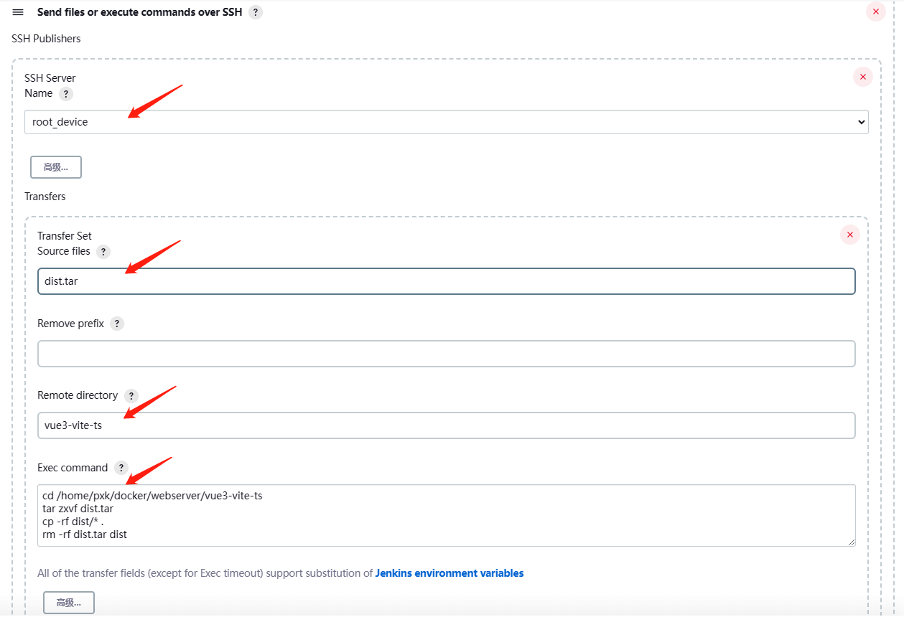

  Exec command 中的命令为：

  ```sh
  cd /home/pxk/docker/webserver/vue3-vite-ts
  tar zxvf dist.tar
  cp -rf dist/* .
  rm -rf dist.tar dist
  ```

### GitLab 中配置 Webhooks

在项目的设置中找到 Webhooks ，URL 填写 [配置 *构建触发器*](#配置 *构建触发器*) 这里的 GitLab Webhook URL ，Secret 令牌 填写 [GitLab 中创建个人访问令牌](#GitLab 中创建个人访问令牌) 这里保存下的令牌，勾选推送事件，然后最下边 **添加webhook** 。

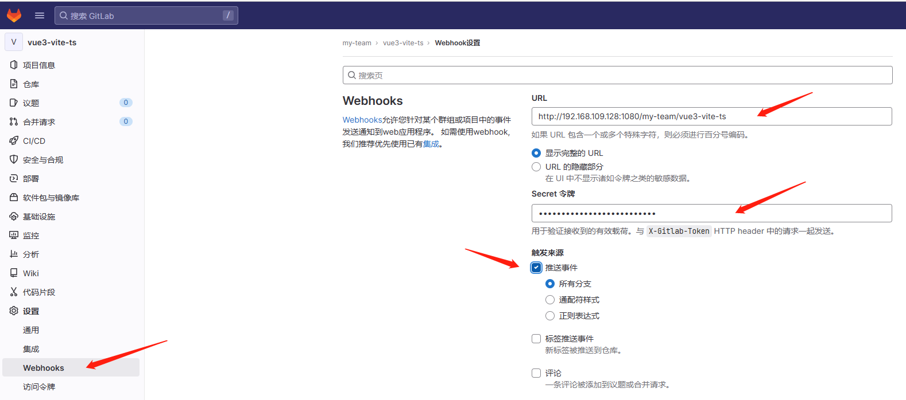

如果遇到下面的问题：

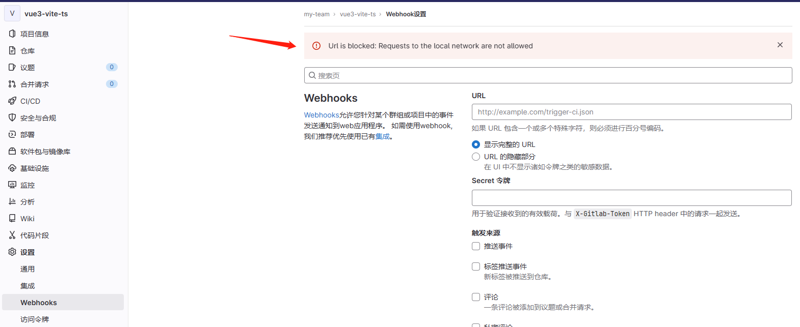

需要到 **管理员** ---> **网络** ---> **出站请求** 这里，勾选上“允许来自 web hooks 和服务对本地网络的请求”，然后 **保存更改**。

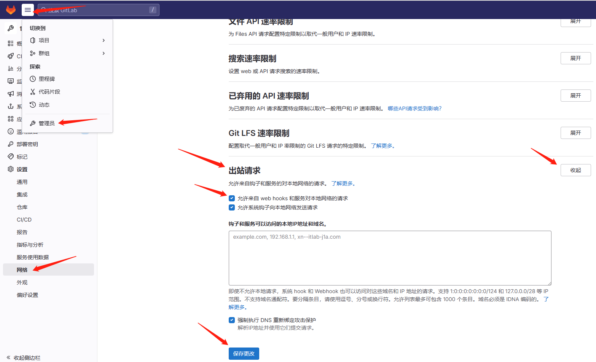

这样再回去 **添加Webhook** 就能成功了。

添加成功之后，在页面最下边会生成一个 Project Hooks ，点击 **测试** ---> **推送事件** 测试一下，这时可能会报一个这样的错误：

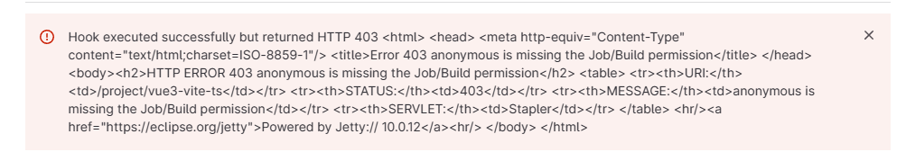

这需要 Jenkins 中改一些安全设置。

Jenkins ---> 系统管理 ---> 全局安全配置 ---> 授权策略 ---> 匿名用户具有可读权限，确保这个选项 **勾选** 。

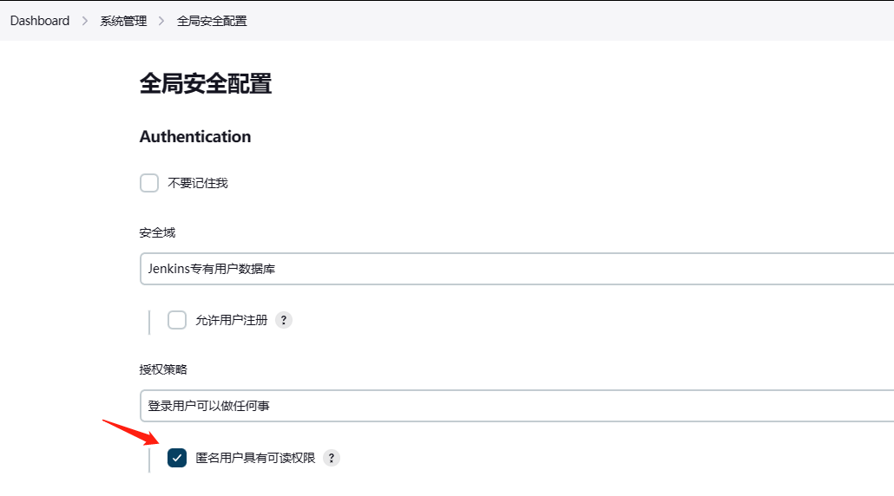

Jenkins ---> 系统管理 ---> 系统配置 ---> Gitlab ---> Enable authentication for '/project' end-point ，确保这个选项 **没选** 。

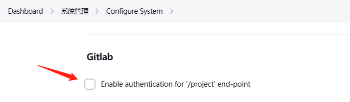

## Jenkins 中构建项目

在主页找到要构建的任务名称，点开后边下拉框，点击 **立即构建** ：

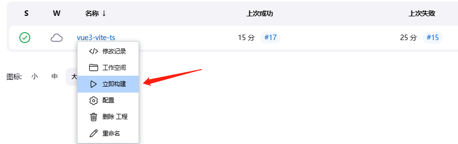

如果最后发送文件时出现这样的错误（从任务点进去会发现有**构建历史**，每条历史都可以展开下拉框查看**控制台输出**）：

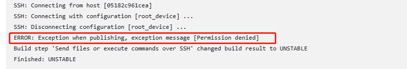

是因为文件发送到的目录的所有者与执行发送命令的用户不是同一个，或者是后者的权限不够，这就需要修改目录所有权。

更改文件或目录所有权的方法：

- 当只需要修改所有者时，`chown [-R] 所有者 文件或目录` ；

- 当需要同时更改所有者和所属组，`chown [-R] 所有者:所属组 文件或目录` 。

-R（注意大写）选项表示连同子目录中的所有文件，都更改所有者。

所以执行以下命令即可（user 与 group 用你自己合适的替换）。

```sh
sudo chown -R user:group vue3-vite-ts
```

修改后即可发送成功。

最后出现下面这些就是部署成功了：

```
Build step 'Send files or execute commands over SSH' changed build result to SUCCESS
Finished: SUCCESS
```

恭喜！可以去浏览器 `ip:81` （ip 用你自己的主机 ip）查看了。
